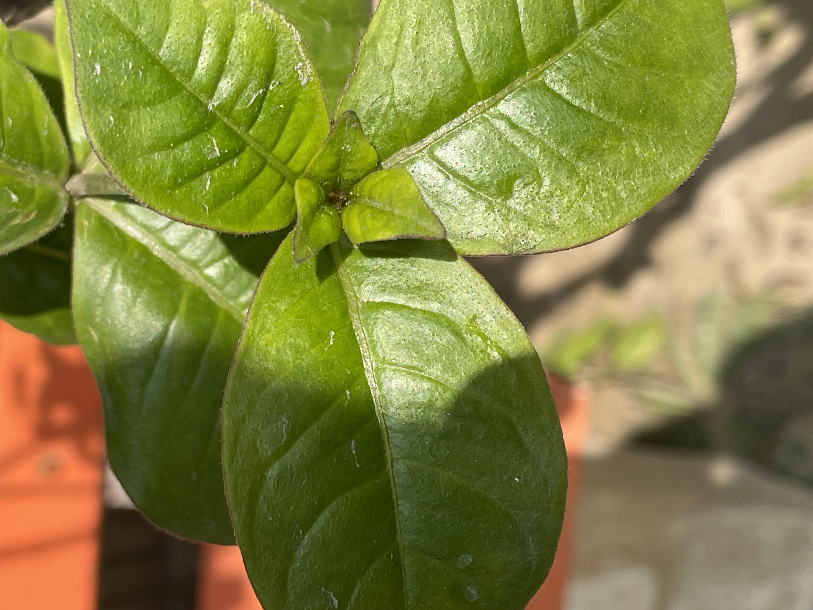
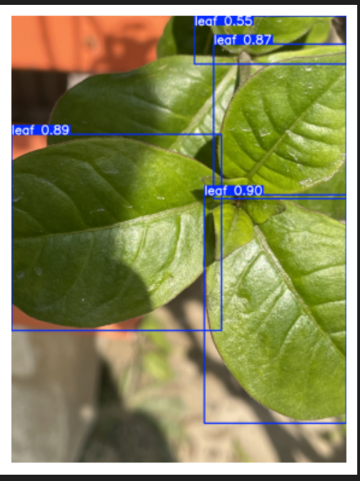
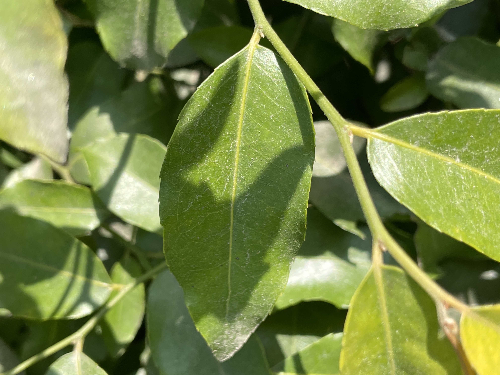
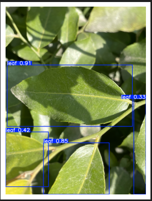

# 🌱 Leaf Detection with Focus Score using YOLOv8


## 📌 Overview
This project implements a **YOLOv8-based leaf detection system** with an additional feature of computing a **focus score** for each detected leaf.  
The focus score ensures **image quality assessment** in real-time, helping identify whether a leaf is properly captured for disease detection and analysis.  

✅ Built for **precision agriculture**  
✅ Trained on **3,000+ annotated leaf images**  
✅ Provides **bounding boxes + focus score**  
##
## 📷 Demo Results

| Input Image | Detection + Focus Score |
|-------------|--------------------------|
|  |  |
|  |  |


---

## 📂 Dataset
- **Size**: ~3,000 images  
- **Classes**: Leaf (single class detection)  
- **Annotations**: YOLO format (txt files with bounding boxes)  
- **Preprocessing**:  
  - Resized to `640x640`  
  - Data augmentation (flip, rotation, blur, contrast)  
  - Train/Validation/Test split: `70/20/10`  

---

## 🏗️ Model Architecture
- **Backbone**: YOLOv8n (lightweight, fast)  
- **Head**: Object detection (1 class: Leaf)  
- **Custom Extension**:  
  - After leaf detection, a **focus score** is computed per bounding box using **Laplacian variance** (sharpness measure).  

---

## 📊 Results
| Metric | Value |
|--------|-------|
| mAP50  | 94.2% |
| mAP50-95 | 88.5% |
| Precision | 88.3% |
| Recall | 87.7% |

- Focus score effectively differentiates **blurry vs sharp leaves**.  
- Improves dataset quality for downstream **disease classification models**.  

---

## ⚙️ Installation

```bash
# Clone repo
git clone https://github.com/Deepakkumar5570/YOLOv8_Leaves-detection8.git
cd leaf-detection-yolov8

```
## Feel free to use and modify for research and educational purposes.
## 🧑‍💻 Author

Deepak Kumar

- 🌐 Portfolio

- 💼 LinkedIn

- 📧 deepak0778671@gmail.com
##
📜 License

This project is licensed under the MIT License.
CopyRighht Deepak Kumar all right reseved 


